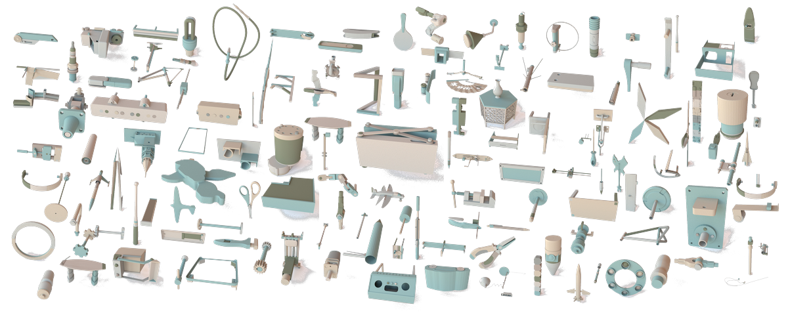
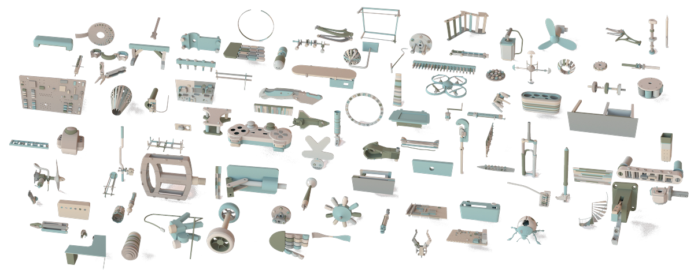

# Ashtin Donuts' forked ASAP

This forked repo adds functionalities to support the hardware we will use at the Embodied AI and Robotic Vision Research Group at UofA.

We will use it to implement and experiment with a real-world deployment of ASAP (Tian et al., 2024).

Updates:

24 Apr 2025 - Started project

Below is content from the original repository
---

This repository contains the official code and dataset of [ASAP: Automated Sequence Planning for Complex Robotic Assembly with Physical Feasibility (ICRA 2024)](http://asap.csail.mit.edu).


**Authors**: Yunsheng Tian, Karl D.D. Willis, Bassel Al Omari, Jieliang Luo, Pingchuan Ma, Yichen Li, Farhad Javid, Edward Gu, Joshua Jacob, Shinjiro Sueda, Hui Li, Sachin Chitta, Wojciech Matusik

**Summary**: The automated assembly of complex products requires a system that can automatically plan a physically feasible sequence of actions for assembling many parts together. In this paper, we present ASAP, a physics-based planning approach for automatically generating such a sequence for general-shaped assemblies. ASAP accounts for gravity to design a sequence where each sub-assembly is physically stable with a limited number of parts being held and a support surface. We apply efficient tree search algorithms to reduce the combinatorial complexity of determining such an assembly sequence. The search can be guided by either geometric heuristics or graph neural networks trained on data with simulation labels. Finally, we show the superior performance of ASAP at generating physically realistic assembly sequence plans on a large dataset of hundreds of complex product assemblies. We further demonstrate the applicability of ASAP on both simulation and real-world robotic setups.

## Installation

### 1. Clone repository

```
git clone git@github.com:yunshengtian/ASAP.git
```

### 2. Python environment

#### Step 1:

```
conda env create -f environment.yml
conda activate asap
```

or

```
pip install numpy networkx matplotlib scipy pyglet rtree sortedcontainers scipy tqdm trimesh torch torch_geometric seaborn ikpy pyquaternion
```

#### Step 2:

Due to dependency issues, the libraries below must be installed after the above step is complete.

```
pip install torch_sparse torch_scatter
```

### 3. Python binding of simulation

```
cd simulation
python setup.py install
```

To test if the installation steps are successful, run:

```
python test_sim/test_simple_sim.py --model box/box_stack --steps 2000
```

We also provide a beam assembly under ``assets/beam_assembly`` folder. To visualize the simulation of that, run:

```
python test_sim/test_multi_sim.py --dir beam_assembly --id original --gravity 9.8 --steps 2000 --friction 0.5 --camera-pos 3.15 -1.24  1.6 --camera-lookat 2.59 -0.55 1.16
```

### 4. Assembly dataset (optional)

Install the training set and test set:

|    Training set (1906 assemblies)        |    Test Set (240 assemblies)     |
| :--------------------------------------: | :------------------------------: |
|  |  |
| [Link (591MB)](https://people.csail.mit.edu/yunsheng/ASAP/dataset_2404/training_assembly.zip) | [Link (124MB)](https://people.csail.mit.edu/yunsheng/ASAP/dataset_2404/test_assembly.zip) |

For point-based SDF collision check to work more accurately, we highly recommend subdividing the assembly meshes to have denser contact points by running ``assets/subdivide_batch.py``. For example, to subdivide the dataset saved in ``assets/test_assembly`` and export to ``assets/test_assembly_dense``:

```
python assets/subdivide_batch.py --source-dir assets/test_assembly --target-dir assets/test_assembly_dense --num-proc NUM_PROCESSES
```

## Experiments

### Sequence planning

Use the following command to run sequence planning on the beam assembly we provided:

```
python plan_sequence/run_seq_plan.py --dir beam_assembly --id original --planner dfs --generator heur-out --max-gripper 2 --base-part 6 --log-dir logs/beam_seq --early-term
```

Important arguments include (see the complete list in `plan_sequence/run_seq_plan.py`):

- `dir`: assembly directory (relative to `assets/`)
- `id`: assembly id
- `planner`: name of the node selection algorithm (i.e., tree search planner) (see `plan_sequence/planner/__init__.py` for supported options)
- `generator`: name of the part selection algorithm (i.e., part generator) (see `plan_sequence/generator/__init__.py` for supported options)
- `seed`: random seed
- `budget`: maximum number of feasibility evaluation
- `max-gripper`: number of available grippers (for assembling and holding parts)
- `max-pose`: number of pose candidates to search from during pose selection
- `pose-reuse`: number of poses to be reused from the parent node for pose selection
- `early-term`: early termination once a feasible plan is found (rather than waiting for the whole tree to be fully expanded)
- `timeout`: timeout in seconds for the whole sequence planning
- `base-part`: id of the base part (if exists) as the first part that stays in place (reorientation will not be allowed then)
- `log-dir`: log directory for storing all the planning outputs
- `plan-grasp`: whether to plan gripper grasps
- `plan-arm`: whether to plan arm motions

### Log folder structure

If `log-dir` is specified in the above command, the log files will be saved in this directory: `{log-dir}/{planner}-{generator}/s{seed}/{id}/`.

There are three files generated:
1. `setup.json` that stores the arguments used for experiments; 
2. `stats.json` that stores the high-level planning results; 
3. `tree.pkl` that stores the explored disassembly tree with all necessary information on edges/nodes.

### Generating results from log

We separate the planning and result generation for flexibility considerations. Suppose you have run the above command for planning, then use the following command to generate planned results:

```
python plan_sequence/play_logged_plan.py --log-dir logs/beam_seq/dfs-heur-out/s0/original/ --assembly-dir assets/beam_assembly/original --result-dir results/beam_seq/ --save-all --camera-pos 3.15 -1.24  1.6 --camera-lookat 2.59 -0.55 1.16
```

Important arguments include (see the complete list in `plan_sequence/play_logged_plan.py`):

- `log-dir`: input log directory
- `assembly-dir`: input assembly directory (absolute path)
- `result-dir`: output result directory
- `save-mesh`: whether to output meshes in the result folder (not necessarily needed, same as meshes in assembly dir)
- `save-pose`: whether to output (reoriented) pose of every assembly step
- `save-part`: whether to output parts to be held
- `save-record`: whether to output rendered videos
- `save-all`: whether to output everything above
- `reverse`: whether to reverse the rendering (to be assembly instead of disassembly)
- `show-fix`: whether to show fixed parts in rendering (in grey)
- `show-grasp`: whether to show gripper grasp in rendering
- `show-arm`: whether to show arm motion in rendering
- `camera-lookat` and `camera-pos`: camera view parameters (to find the best view for rendering, you can do that by pressing ``V`` in simulation viewer when testing the simulation for your assembly, also see the below [Simulation Viewer section](https://github.com/yunshengtian/ASAP#simulation-viewer))

If `save-all` is specified, the results will be saved in `result-dir` with the following structure. 
Assume there are `N` parts, `N-1` assembly steps, `T` time steps in each assembly step, 
N part ids are `{p0}, {p1}, ... {pN-1}`, and N-1 ordered part ids following the disassembly order are `{p'0}, {p'1}, ..., {p'N-2}`:

```
mesh/ --- meshes of individual parts
 ├── part{p0}.obj
 ├── ...
 └── part{pN-1}.obj
part_fix/ --- parts to be held in every assembly step
 ├── 0_{p'0}.json
 ├── ...
 └── N-2_{p'N-2}.json
path/ --- geometric assembly paths in every time step in every assembly step (4x4 transformation matrices)
 └── 0_{p'0}/
     └── 0/
         ├── part{p0}.npy
         ├── ...
         └── part{pN-1}.npy
     ├── ...
     └── {T-1}/
 ├── ...
 └── N-2_{p'N-2}/
pose/ --- global pose of the whole (sub)assembly in every assembly step (4x4 transformation matrix)
 ├── 0_{p'0}.npy
 ├── ...
 └── N-2_{p'N-2}.npy
record/ --- (dis)assembly animations in every assembly step
 ├── 0_{p'0}.gif
 ├── ...
 └── N-2_{p'N-2}.gif
```

After the animations are generated, you can use `plan_sequence/combine_animation.py` to concatenate all videos into a single one.

### Batch sequence planning

Use `plan_sequence/run_seq_plan_batch.py` to run batch sequence planning for all assemblies in the assembly directory (with similar arguments as shown above for the serial script). The log folders will be saved in this directory: `{log-dir}/g{max-gripper}/{planner}-{generator}/s{seed}/`.

To check success rates quantitatively, run:
```
python plan_sequence/check_success_rate_batch.py --log-dir {log-dir}/g{max-gripper}
```

## Simulation Viewer

Some tips to interact with the simulation viewer:

- Scroll your mouse wheel to zoom in/out.
- Move your mouse while holding down the left mouse button to rotate the camera.
- Move your mouse while holding down ``Shift`` + left mouse button to move around the scene.
- Press ``S`` to slow down and ``F`` to speed up the simulation.
- Press ``Space`` to pause/resume the simulation.
- Press ``V`` for outputting the camera parameters (lookat and pos).

## Custom Assembly Usage

To run the algorithm on your custom assembly meshes, some pre-processing on the meshes need to be done since the meshes could be of arbitrary scales and the vertex density of meshes may not be enough for accurate point-based collision checking.

We provide a pre-processing script `assets/process_mesh.py` that rescales the custom meshes to provide an unified input to the algorithm. Assume you have a set of .obj meshes placed under `source_dir/` that form an assembly and are all in the assembled states. Run:

```
python assets/process_mesh.py --source-dir source_dir/ --target-dir target_dir/ --subdivide
```

Then, all the pre-processed meshes will be written to the output directory `target_dir/`. 

To run our algorithm on top of them, just specify `--dir` and `--id` accordingly for the scripts in the above [Experiments section](https://github.com/yunshengtian/ASAP#experiments) to make sure they can find `target_dir/`.


## Contact

Please feel free to contact yunsheng@csail.mit.edu or create a GitHub issue for any questions about the code or dataset.

## Citation

If you find our paper, code or dataset is useful, please consider citing:

```
@article{tian2023asap,
  title={ASAP: Automated Sequence Planning for Complex Robotic Assembly with Physical Feasibility},
  author={Tian, Yunsheng and Willis, Karl DD and Omari, Bassel Al and Luo, Jieliang and Ma, Pingchuan and Li, Yichen and Javid, Farhad and Gu, Edward and Jacob, Joshua and Sueda, Shinjiro and others},
  journal={arXiv preprint arXiv:2309.16909},
  year={2023}
}
```
